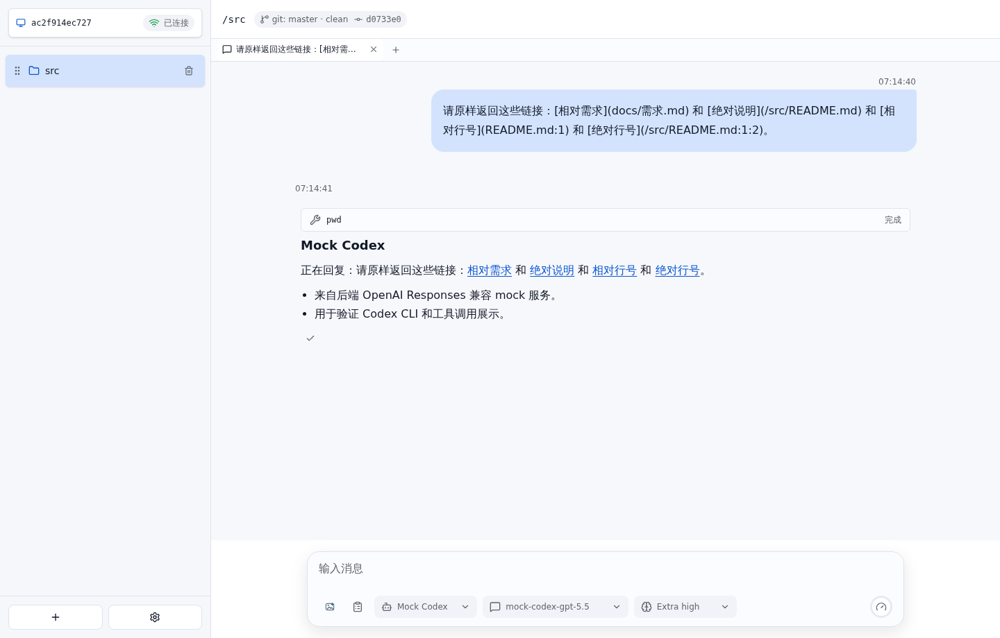

# Markdown 文件链接 E2E 测试报告

- 结果: 通过
- 日志: [test.log](logs/test.log)
- 服务日志: [server.log](logs/server.log)

## 过程

- Agent markdown 中的相对文件路径和绝对文件路径都会渲染为文件系统 API 链接，打开后返回后端文件内容。
- 复制 assistant 回复时保留 agent 返回的原始 markdown，不复制展示层改写后的 API 地址。

