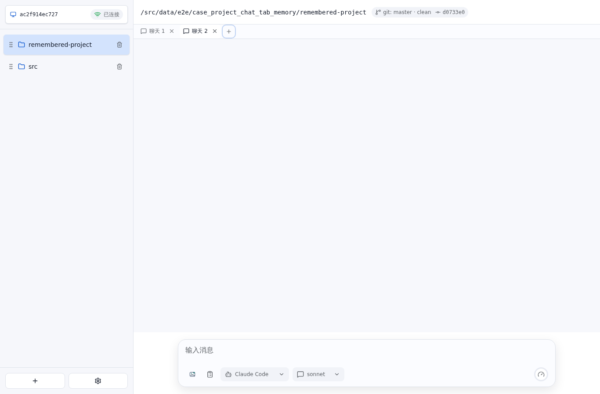

# Project 聊天页记忆 E2E 测试报告

- 结果: 通过
- 日志: [test.log](logs/test.log)
- 服务日志: [server.log](logs/server.log)

## 过程

- 第一个 Project 新建并选中第二个聊天页。
- 第二个 Project 也新建并选中第二个聊天页。

- 切回第一个 Project 时，自动恢复到此前选中的第二个聊天页。
- 再次切回第二个 Project 时，同样恢复该 Project 自己的第二个聊天页。

