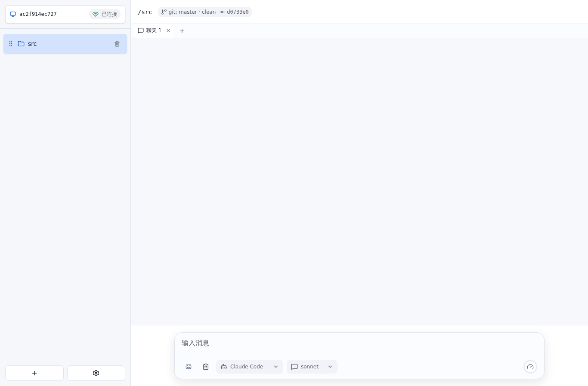

# WebSocket 和子路径状态同步 E2E 测试报告

- 结果: 通过
- 日志: [test.log](logs/test.log)
- 服务日志: [server.log](logs/server.log)

## 过程

- 页面从 /console/ 子路径打开后，WebSocket 状态变为已连接，并收到后端状态快照。

- 服务启动后自动添加 Git 工作目录为 project 并打开聊天页，hash 路由指向 project，刷新页面仍从后端内存状态恢复。

