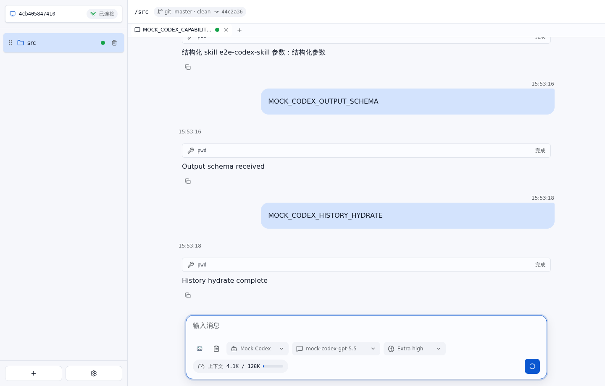

# Codex app-server 对齐 E2E 测试报告

- 结果: 通过
- 日志: [test.log](logs/test.log)
- 服务日志: [server.log](logs/server.log)

## 过程

- Mock Codex app-server 启动后，AgentHub 从 model/list 更新模型和思考深度。
- 命中 Codex skill 的 slash command 会以结构化 skill 输入发送给 app-server。
- WebSocket chat.send 可携带 outputSchema，并透传到 Codex turn/start。
- 服务重启后，前端通过聊天 timeline 恢复历史消息并继续当前 Codex turn。

