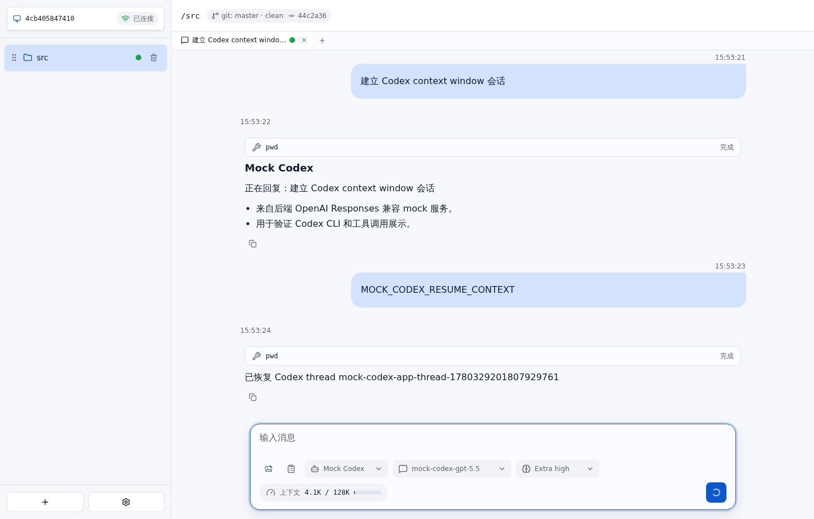

# Codex 恢复和上下文 E2E 测试报告

- 结果: 通过
- 日志: [test.log](logs/test.log)
- 服务日志: [server.log](logs/server.log)

## 过程

- 首轮 Codex 运行后，前端展示 context window，后端持久化 thread ID。
- 后端重启后，AgentHub 使用持久化 thread ID 恢复 Codex app-server 会话并继续发送 prompt。

