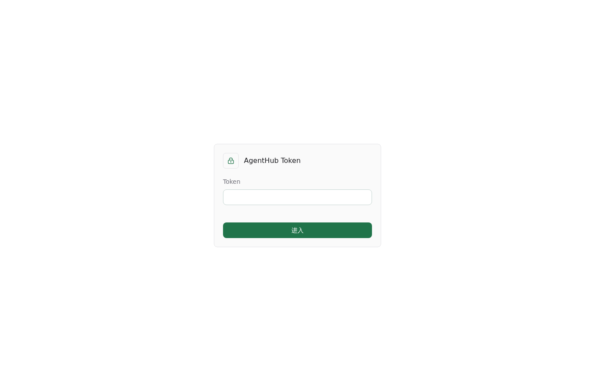
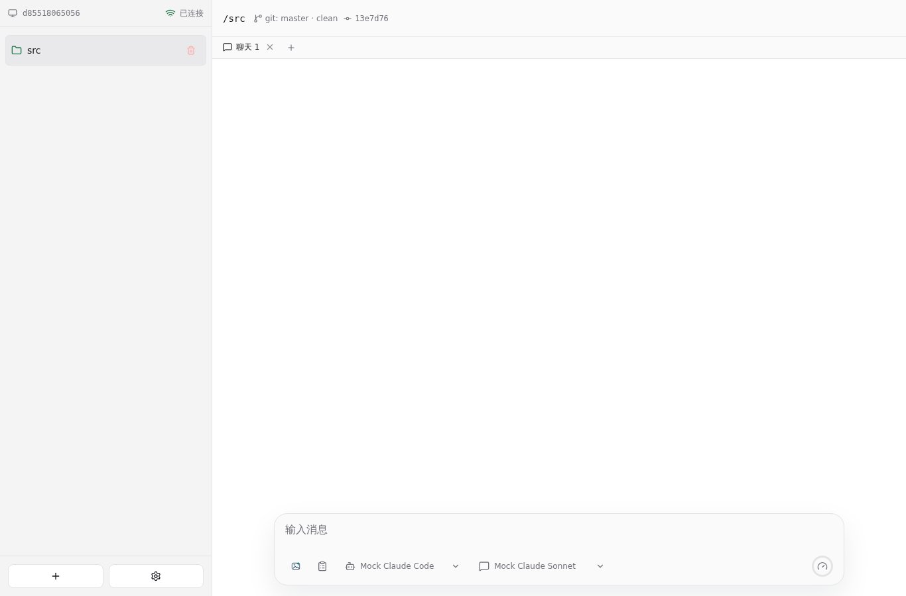

# Token 鉴权 E2E 测试报告

- 结果: 通过
- 日志: [test.log](logs/test.log)
- 服务日志: [server.log](logs/server.log)

## 步骤

- AGENTHUB_TOKEN 非空时，前端先展示 token 输入界面，不连接工作台。
- 输入错误 token 时，前端保持在 token 输入界面，且不会持久化错误 token。
- 输入正确 token 后，前端连接 WebSocket 并只把 AGENTHUB_TOKEN 写入持久化状态。
- 刷新页面后，前端复用已储存的 AGENTHUB_TOKEN，不再储存其它状态。

## 截图

