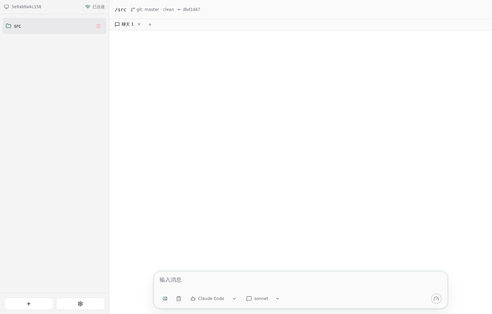
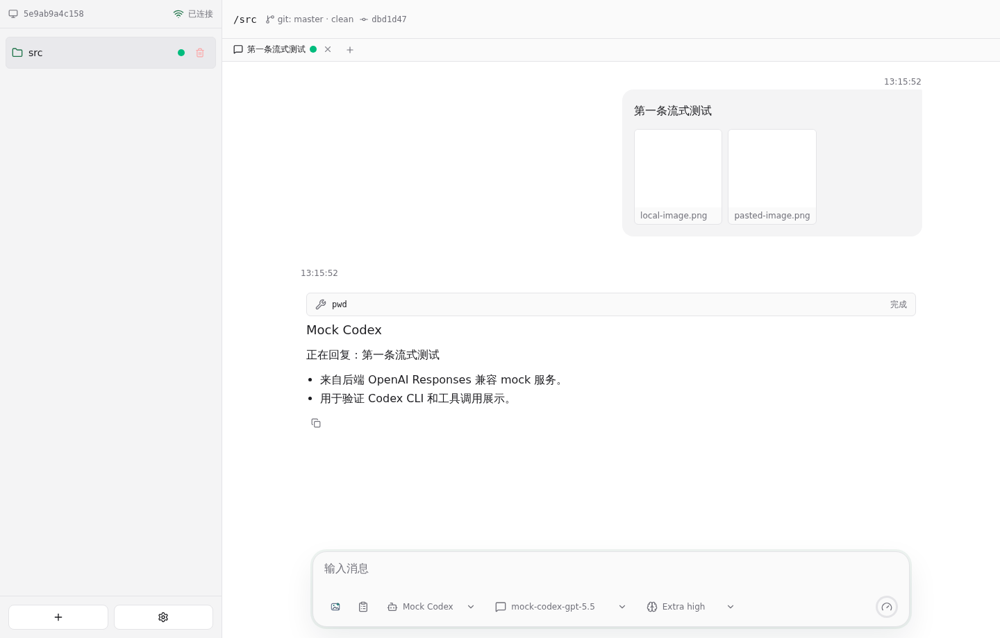
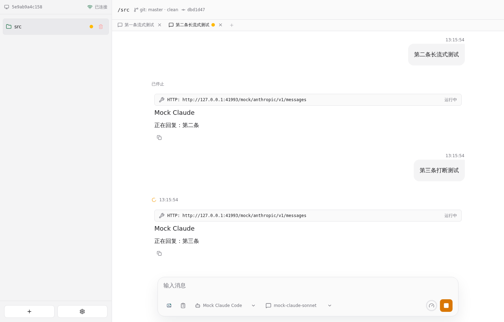

# Agent 聊天 E2E 测试报告

- 结果: 通过
- 日志: [test.log](logs/test.log)
- 服务日志: [server.log](logs/server.log)

## 过程

- 前端使用 paseo 浅色工作台风格，侧栏左下角集中展示连接状态、机器名、添加项目和设置入口。
- 服务启动后自动添加 Git 工作目录为 project；顶部同一行展示完整路径和单份 git 信息，侧边栏只显示最后一级目录名，任务栏固定在底部。

- Agent 设置页可以向 Claude Code 模型选项列表添加新模型。
- 聊天框中的选择框宽度会根据当前实际选项内容调整。
- 聊天框下方可以选择 agent、模型和推理级别，未输入时不显示发送按钮和 Agent 标签。
- 输入 / 时后端会刷新最新 skills；列表变化时服务日志输出 skills 列表，前端菜单同步展示新 skill，并支持点击、键盘上下键选择和 Tab 快速确认当前项。
- 聊天框添加图片按钮使用图片 logo，可以选择本地图片，Ctrl+V 可以粘贴剪贴板图片，并在发送前展示附件预览。
- Mock Codex 通过内置 Codex CLI 请求后端 OpenAI mock 模型服务，工具调用标题直接展示命令并排在输出前。

- 聊天页开始会话后只锁定 agent，模型和推理级别仍然可调整，聊天框不显示已锁定文字。
- 新聊天默认继承上一次选择的 agent、模型和推理级别；每个聊天 Tab 保留独立输入草稿和滚动位置，文字草稿刷新后从后端恢复，离开期间有新输出时切回会滚动到底部；E2E 使用 Mock Claude Code 命令连接服务端 mock 模型服务。
- 聊天页第一次发送 prompt 后，Tab 标题显示本次聊天主题；agent 正在输出时直接输入并回车，会停止上一轮并发送新的 prompt。
- 刷新页面后仍能从后端恢复 project、聊天和 mock Claude 正在输出的会话。

- agent 输出完成后，停止按钮重新变回发送按钮。
- Mock Codex 和 Mock Claude Code 都能在 mock 模型服务下生成 plan、按用户意见修订，并点击开始执行。
- agent 报错时，错误信息会返回并显示在前端聊天记录中。
