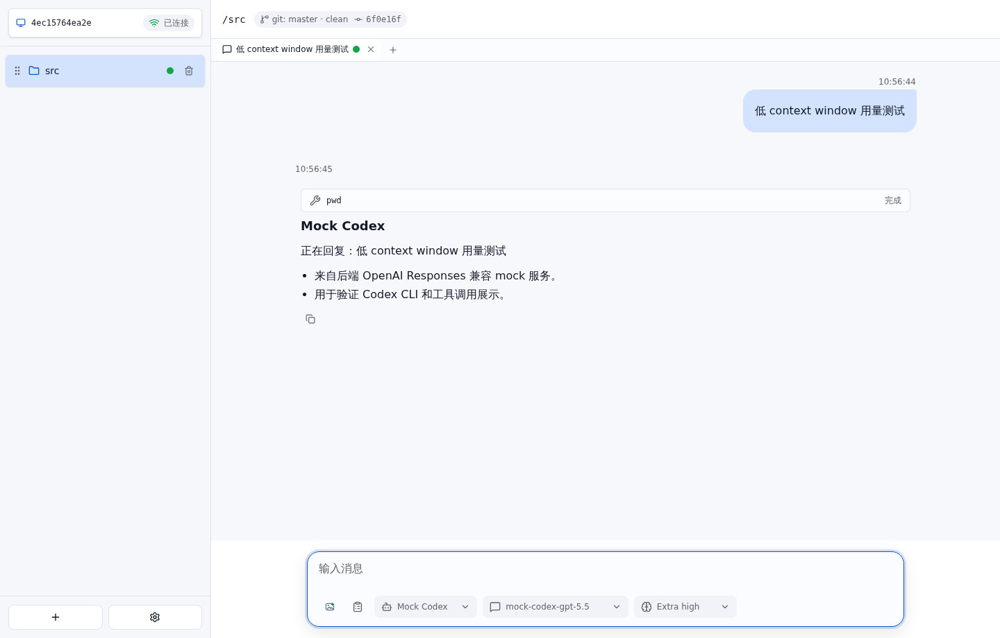

# Context window 图标 E2E 测试报告

- 结果: 通过
- 日志: [test.log](logs/test.log)
- 服务日志: [server.log](logs/server.log)

## 过程

- 没有 agent 真实上报 context window 数据时，不显示 context window 图标。
- agent 真实上报数据低于 context window 的 1/4 时，也不显示图标。

